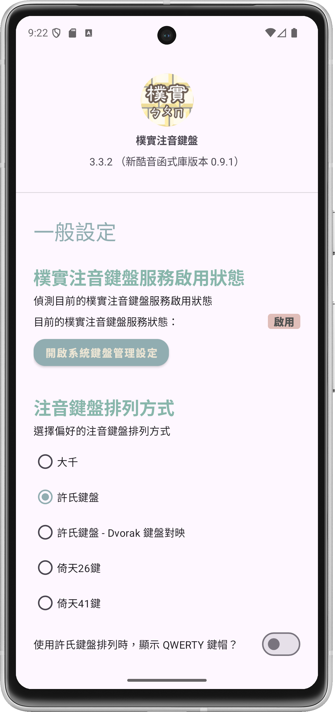
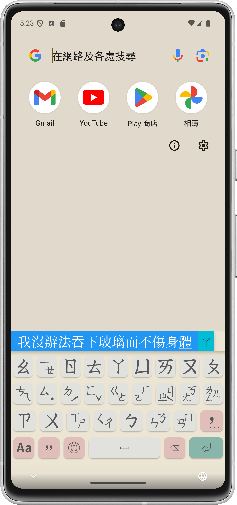

# Guileless Bopomofo 樸實注音鍵盤

## About 這是啥

A [Bopomofo](https://en.wikipedia.org/wiki/Bopomofo) software keyboard (aka input method editor) on Android, which is utilizing [libchewing](http://chewing.im/) for intelligent phonetic processing.

樸實注音鍵盤是 Android 平台上的[注音符號](https://zh.wikipedia.org/wiki/%E6%B3%A8%E9%9F%B3%E7%AC%A6%E8%99%9F)軟體鍵盤（輸入法），藉由[新酷音輸入法](http://chewing.im/)程式庫的輔助，提供自動選字處理機能。

Please only download and install this software from the two marketplaces mentioned above, or through [the APK packages released by this project](https://github.com/hiroshiyui/GuilelessBopomofo/releases), to ensure your information security.

請只在以上兩處市集，或透過[本專案釋出之 APK 安裝套件包](https://github.com/hiroshiyui/GuilelessBopomofo/releases)取得、安裝本軟體，以保障您的資訊安全。

## Usage 使用

### Soft keyboard 軟體鍵盤

以防您不知道：「大千」就是市面上最常見的那種一列一列將注音符號依序排列的鍵盤。

至於「許氏鍵盤」與「倚天26鍵」都是比較符合人體工學的注音鍵盤排列，不過我知道 99% 慣用「大千」鍵盤的人，在雙手跟我一樣發生病變、疼痛不堪、懷疑敲鍵盤的職涯就此終止之前，都不會考慮嘗試改用的，所以我就說說而已。

我之所以開發這個輸入法編輯器，原因之一，就是我想在電腦上、手機上使用一致的許氏鍵盤。

### Physical keyboard 實體鍵盤

幾個常用控制鍵：
  * 左 <kbd>Shift</kbd> + <kbd>空白鍵</kbd>：切換注音與英數字輸入模式
  * <kbd>Alt</kbd> + <kbd>空白鍵</kbd>：切換全形與半形
  * 長按左 <kbd>Alt</kbd>：切換其他輸入法
  * 長按右 <kbd>Shift</kbd>：開啟常用標點符號候選清單，按左右鍵換頁
  * 鍵盤左上方的 <kbd>`</kbd> 鍵：開啟各種類別的符號候選清單，按左右鍵換頁

有些奇怪的 Android 機種，是無法正常偵測到實體鍵盤的，但是鍵盤按鍵卻還可以作用，所以「啟用增強型實體鍵盤支援模式」就是強制把介面切換為搭配實體鍵盤的精簡外觀。這個模式的密技是這樣的：如果啟用這個強制模式，那麼在最上排的緩衝區的空白處，連點兩下，可以切換完整軟體鍵盤與精簡外觀的介面。

如果在打開「使用實體鍵盤」與「啟用增強型實體鍵盤支援模式」後，您的實體鍵盤仍舊無法使用，那 99.9% 是您鍵盤或手機、平板電腦這兩端其中一端的問題，換個鍵盤，或換個裝置交叉測試看看吧。

## Build 組建

1. Get source code:

        git clone --recursive https://github.com/hiroshiyui/GuilelessBopomofo.git

1. Build it:
    * Import this project into Android Studio, then run **"Buile -> Make Project"**, or...
    * execute `./gradlew :app:assembleDebug` or `./gradlew :app:assembleRelease` from shell command line

1. Locate the generated APK files from `./app/build/outputs/apk/`

1. Enjoy!

## Acknowledgements 感謝有您

* [Chewing contributors](http://chewing.im/about.html) 沒有這些高手維護新酷音，就沒有這個衍生的產品
* [Bobby Tung](https://bobtung.medium.com/) 推薦我精緻的注音符號字型
* [Wen-Chun Lin](https://github.com/cataska) 在我失意落魄時（雖說至今依然），多次從台北開車來宜蘭找我吃飯聊天
* [Jim Huang (jserv)](https://github.com/jserv) 從[很久很久以前](https://ghostsinthelab.org/2013/05/03/%e7%ad%86%e8%a8%98%ef%bc%9a%e7%b7%a8%e5%87%ba%e7%b5%a6-arm-linux-androideabi-%e7%94%a8%e7%9a%84-libchewing/)就鼓勵我把這個專案做出來，後來還贊助了我一大筆款項，讓我在遭逢筆電故障、有如窮途末路時，有錢可以組一台桌機繼續戰鬥
* [StarForcefield](https://starforcefield.wordpress.com/) 他寫的[新酷音範例程式](https://starforcefield.wordpress.com/2012/08/13/%e6%8e%a2%e7%b4%a2%e6%96%b0%e9%85%b7%e9%9f%b3%e8%bc%b8%e5%85%a5%e6%b3%95%ef%bc%9a%e4%bd%bf%e7%94%a8libchewing/)文章，啟發了我驗證跨平台編譯、執行 PoC 程式的可行性與效用
* [Weizhong Yang (zonble)](https://github.com/zonble) 如果沒有他推坑我實作支援實體鍵盤，我其實本來不想要做，您各位能爽爽用（或不爽卻湊合著、忍著用）實體鍵盤，請先謝謝他
* My dear friends, my family, and my wife.

## One more thing 如有本文說明未竟之處……

請參閱 [Wiki](https://github.com/hiroshiyui/GuilelessBopomofo/wiki) 文件。
