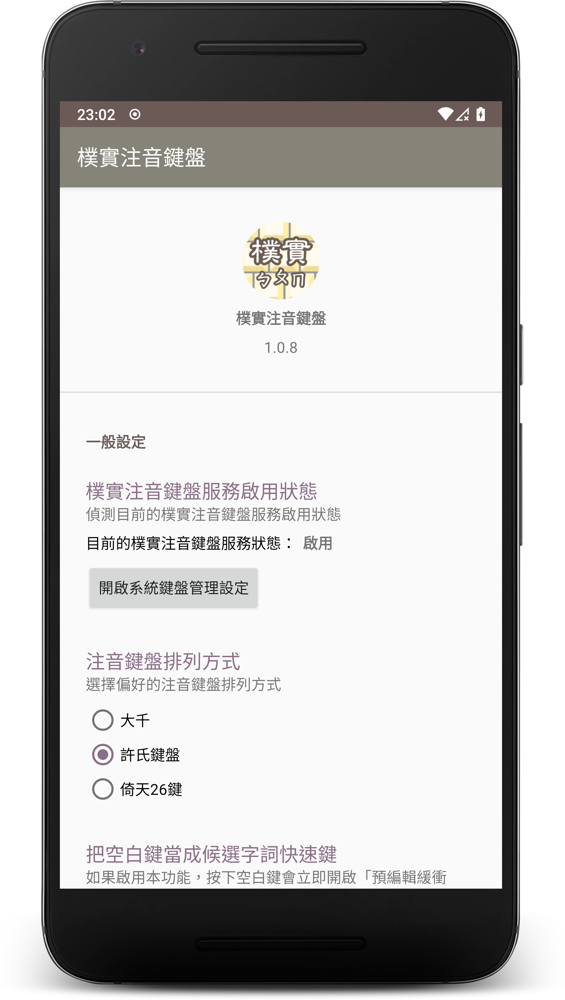
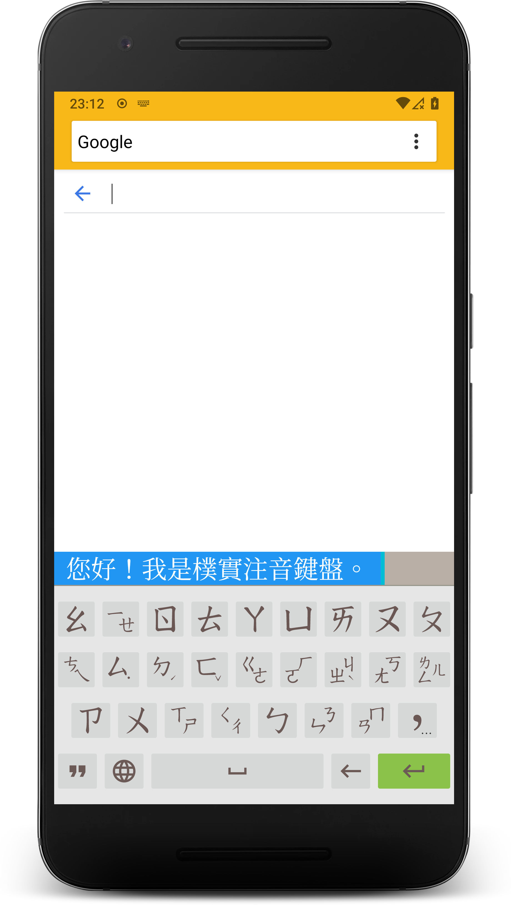

# Guileless Bopomofo 樸實注音鍵盤

## About

A [Bopomofo](https://en.wikipedia.org/wiki/Bopomofo) software keyboard (aka input method editor) on Android, which is utilizing [libchewing](http://chewing.im/) for intelligent phonetic processing.

## TL;DR

1. Get source code:

        git clone --recursive https://github.com/hiroshiyui/GuilelessBopomofo.git

1. Build essential data files of libchewing:

        cd GuilelessBopomofo/app/libs/libchewing && ./build-android.sh

1. Import this project into Android Studio

1. Build it, enjoy!

## Sponsor me or hire me!

* https://www.patreon.com/hiroshiyui
* https://www.linkedin.com/in/huihongyou/

## Acknowledgements

* [Chewing contributors](http://chewing.im/about.html)
* [Bobby Tung](https://bobtung.medium.com/)
* [Wen-Chun Lin](https://github.com/cataska)
* [Jim Huang (jserv)](https://github.com/jserv)
* [StarForcefield](https://starforcefield.wordpress.com/)
* My dear friends, my family, and my wife.
