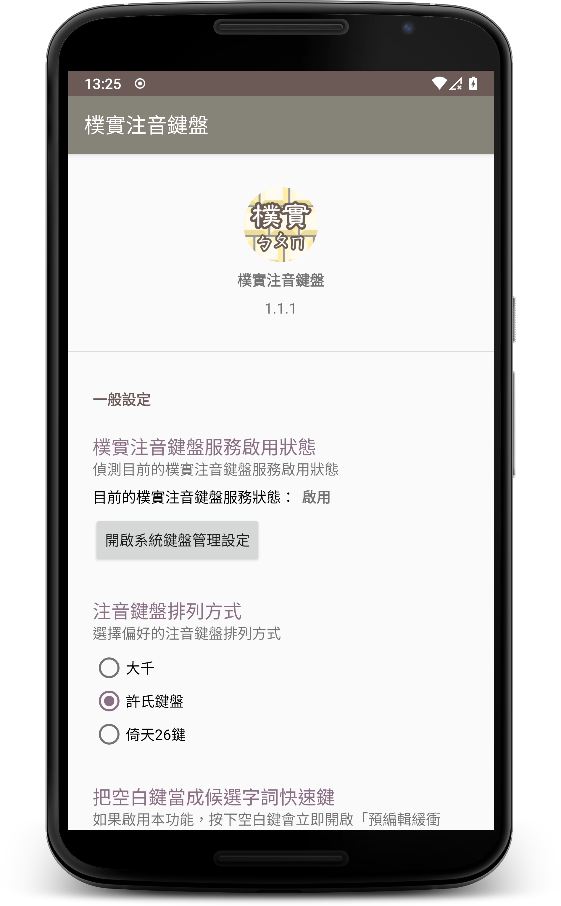
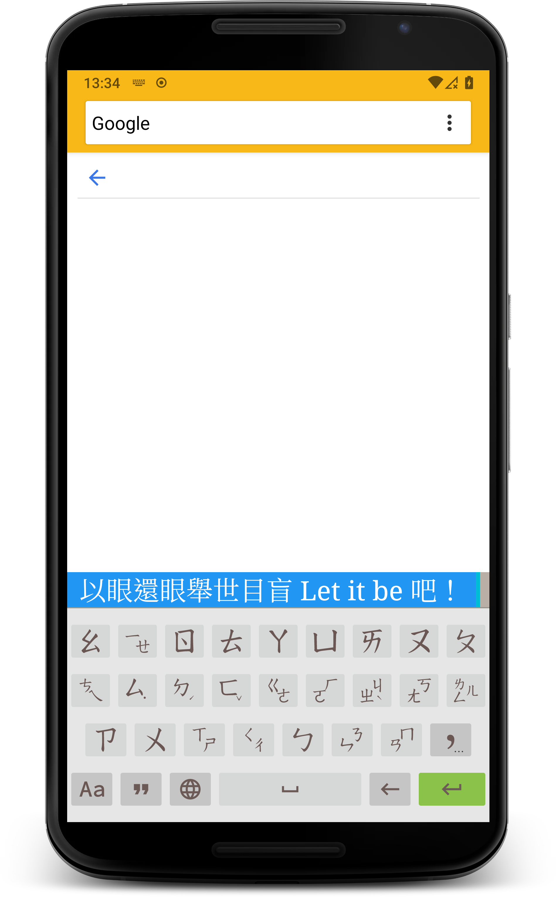

# Guileless Bopomofo 樸實注音鍵盤

## About 這是啥

A [Bopomofo](https://en.wikipedia.org/wiki/Bopomofo) software keyboard (aka input method editor) on Android, which is utilizing [libchewing](http://chewing.im/) for intelligent phonetic processing.

樸實注音鍵盤是 Android 平台上的[注音符號](https://zh.wikipedia.org/wiki/%E6%B3%A8%E9%9F%B3%E7%AC%A6%E8%99%9F)軟體鍵盤（輸入法），藉由[新酷音輸入法](http://chewing.im/)程式庫的輔助，提供自動選字處理機能。

## TL;DR 廢話不多說

1. Get source code:

        git clone --recursive https://github.com/hiroshiyui/GuilelessBopomofo.git

1. Build it:
    * Import this project into Android Studio, then run **"Buile -> Make Project"**, or...
    * execute `./gradlew :app:assembleDebug` or `./gradlew :app:assembleRelease` from shell command line

1. Locate the generated APK files from `./app/build/outputs/apk/`

1. Enjoy!

## Sponsor me or hire me! 贊助我，或者僱用我

* https://www.patreon.com/hiroshiyui (long term sponsorship 長期贊助)
* https://paypal.me/hiroshiyui (one-time donation 單筆捐款)
* https://www.linkedin.com/in/huihongyou/ (My LinkedIn profile 我是誰)

## Acknowledgements 感謝有您

* [Chewing contributors](http://chewing.im/about.html)
* [Bobby Tung](https://bobtung.medium.com/)
* [Wen-Chun Lin](https://github.com/cataska)
* [Jim Huang (jserv)](https://github.com/jserv)
* [StarForcefield](https://starforcefield.wordpress.com/)
* My dear friends, my family, and my wife.
